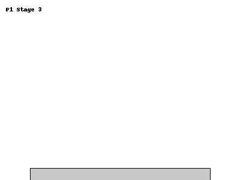
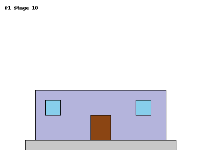
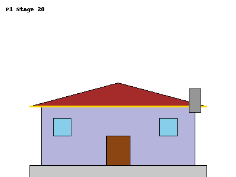

# 🏗️ Construction Progress Tracker

## 📋 Intent

This project provides an automated system to **analyze** and **estimate**
construction project progress by comparing a sequence of site photos over
time.  
It uses **pretrained deep learning models** (ResNet variants) to extract
features from images and **estimate percentage changes** between them.  
The system also stores progress information in a **SQLite database** and
generates **visual reports**.

**Background:**  
This project originated from a **proof of concept (POC)** during work, where the
goal was to determine if construction progress could be effectively tracked over
time using only photographic evidence and OpenAI.  
This repository is an **extension** and **refinement** of that initial
experiment, incorporating additional features, robustness improvements, and
visualization capabilities.

**Main Features:**

- Analyze construction images to compute project progress.
- Track cumulative progress and frame-to-frame changes.
- Save analysis results to a local database.
- Generate visualizations of progress over time.

---

## 🛠️ Installation

### 1. Clone the Repository

```bash
git clone https://github.com/andrew-t-james/final-project.git
cd final-project/progress_detection
```

### 2. Install uv (if not already installed)

uv is a fast Python package installer and resolver.

Refer to the official uv documentation:  
👉 [https://docs.uv.dev/getting-started/installation](https://docs.uv.dev/getting-started/installation)

### 3. Set up a Python Virtual Environment

```bash
uv venv
source .venv/bin/activate    # Linux/Mac
.\.venv\Scriptsctivate     # Windows
```

### 4. Install Project Dependencies with uv

Instead of `pip install`, use `uv` to install:

```bash
uv pip install
```

Optional (for extended functionality):

```bash
uv pip install transformers
```

> ℹ️ **Note:**  
> This project does **not** use a `requirements.txt` file by default.  
> Dependencies are installed manually through `uv pip install` commands.

(If you want, you can create one later by running:)

```bash
uv pip freeze > requirements.txt
```

---

### 5. Run the The Projects

#### I took two separate approaches at predicting construction progress. Attempt one was demoed in my presentation, 
and attempt two required training a model and would have taken to long for the presentation.

##### Attempt one is a simple proof of concept that uses a pretrained model to extract features from the images and then uses those features to predict the progress.ResNet

```bash
cd attempt_one

uv run main.py

```


##### Attempt two is my attempt at supervised learning model to predict the progress. I generated syntehtic data to train the model. The syntehtic data is in `progress_detection/attempt_two/unique_synthetic_construction_detailed`. 

**Examples of synthetic images created**

<table>
  <tr>
    <td></td>
    <td></td>
  </tr>
  <tr>
    <td></td>
    <td></td>
  </tr>
  <tr>
    <td align="center">Baseline</td>
    <td align="center">Beginning</td>
  </tr>
  <tr>
    <td align="center">Midpoint</td>
    <td align="center">Finished</td>
  </tr>
</table>

```bash
cd attempt_two

uv run train_progress_model.py \
  --csv unique_synthetic_construction_detailed/progress_labels.csv \
  --images unique_synthetic_construction_detailed/ \
  --out progress_model.pth

# or with optional arguments
uv run train_progress_model.py \
  --csv unique_synthetic_construction_detailed/progress_labels.csv \
  --images unique_synthetic_construction_detailed/ \
  --out progress_model.pth \
  --epochs 100 \
  --batch 32 \
  --lr 0.001 \
  --patience 10

# generate results based on the trained model
uv run infer_progress.py \
  --images unique_synthetic_construction_detailed/ \
  --model progress_model.pth \
  --output predicted_progress.csv
```


## ⚙️ Notes

- Utilizes **PyTorch Hub models** (`resnet50`) for feature
  extraction.
- Designed for **small-to-medium sized image datasets** (~10–100 images).
- Assumes **fixed camera angles** and relatively consistent lighting for
  accurate tracking.
- No model training — purely feature-based progress estimation.

---

# 🚀 Future Improvements

## Model Enhancements

- Implement multi-model ensemble for more robust feature extraction
- Add support for YOLO or similar object detection to track specific
  construction elements
- Integrate transformer-based architectures for better temporal understanding
- Develop custom model training on construction-specific datasets

## Feature Detection

- Add semantic segmentation to identify different construction phases
- Implement weather condition detection and compensation
- Develop adaptive feature weighting based on construction phase
- Add support for night-time construction analysis

## Progress Tracking

- Implement milestone detection and automatic phase classification
- Add support for multiple camera angles and viewpoint synthesis
- Develop predictive analytics for project timeline estimation
- Create anomaly detection for unexpected construction patterns

## Visualization & Reporting

- Add interactive web dashboard for progress monitoring
- Implement 3D reconstruction from image sequences
- Generate automated progress reports with key metrics
- Add support for AR visualization of progress overlays

## Technical Improvements

- Optimize memory usage for large image sequences
- Add distributed processing support for large projects
- Implement real-time processing capabilities
- Add support for video input analysis

## User Experience

- Create GUI interface for non-technical users
- Add mobile app support for on-site updates
- Implement cloud storage integration

## Data Management

- Add support for multiple project tracking
- Implement data versioning for progress history
- Add export functionality to various formats
- Create backup and recovery systems

## Integration Capabilities

- Add API endpoints for third-party integration
- Implement webhooks for progress notifications
- Add support for BIM model integration
- Create plugins for common construction management software

## Analytics

- Add cost estimation based on progress
- Implement resource utilization tracking
- Add weather impact analysis
- Develop completion time prediction models

## Documentation & Testing

- Add comprehensive API documentation
- Create automated testing suite
- Add performance benchmarking tools
- Implement continuous integration/deployment
