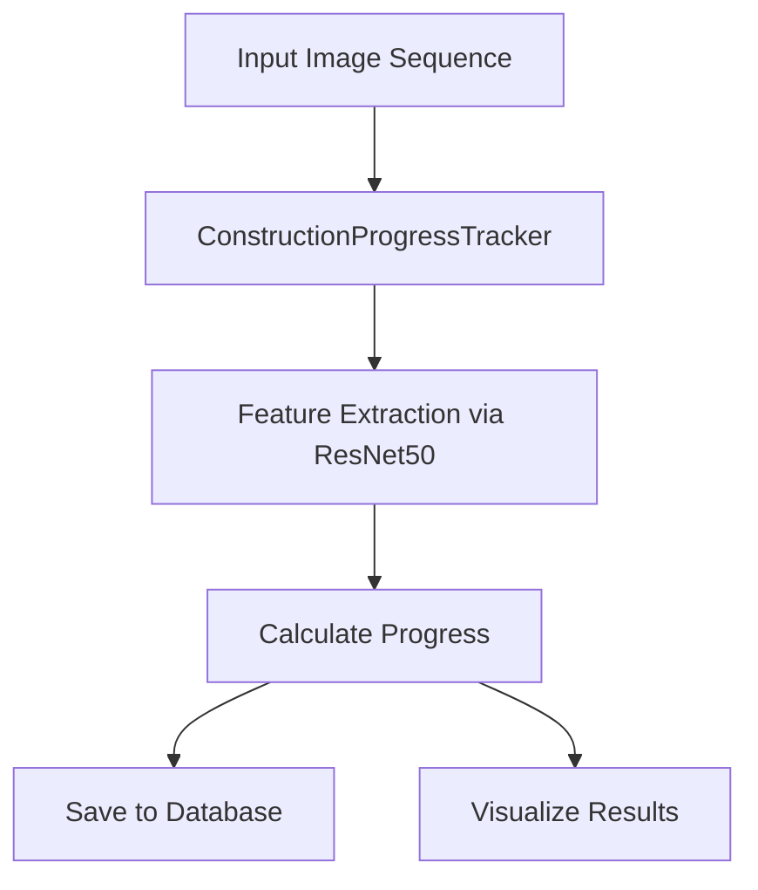

# Construction Progress Tracker – System Overview

This system automatically estimates and visualizes construction progress by analyzing a series of site images. It uses a pre-trained deep learning model (ResNet50), compares feature changes between images, stores data, and generates charts.

---

# Architecture Diagram



<!--
notes:
- The system starts by reading a sequence of construction photos.
- It uses a model trained to "see" like a human (ResNet50) to extract meaningful patterns from each photo.
- Then it compares those patterns to previous ones to estimate how much progress was made.
- It saves results to a database and produces charts to help visualize the construction timeline.
-->

---

# Core Component: ConstructionProgressTracker

- Uses a ResNet50 model to extract features from each image.
- Compares feature vectors to detect changes between frames.
- Calculates progress % based on differences and scaling logic.

```python
features = tracker.analyze_image(img_path)
progress, delta = tracker.calculate_progress(features)
```

<!--
notes:
- This is the brain of the system.
- It processes each image and calculates how much more of the project seems complete compared to the last photo.
- It adjusts for changes slowing down as progress approaches 100%.
-->

---

# DatabaseManager

- Stores image path, progress %, and features in a SQLite database.
- Serializes model features using Torch.
- Avoids saving if values are missing.

```python
db_manager.save_progress(img, timestamp, progress, delta, features)
```

<!--
notes:
- This keeps a permanent log of results in a small built-in database.
- It also saves what the model "saw" so results can be revisited or debugged later.
-->

---

# ProgressVisualizer

- Records each progress estimate over time.
- Plots two charts:
  - Total progress % over time.
  - How much change occurred between each step.

```python
visualizer.add_datapoint(index, progress, delta, features)
visualizer.plot_progress()
```

<!--
notes:
- This creates graphs so users can quickly see how fast (or slow) construction is moving.
- It shows both the overall progress and the difference between each photo.
-->

---

# Main Flow

```python
main():
    tracker = ConstructionProgressTracker()
    db = DatabaseManager()
    visualizer = ProgressVisualizer()

    for image in sorted_images:
        features = tracker.analyze_image(image)
        progress, delta = tracker.calculate_progress(features)
        db.save_progress(...)
        visualizer.add_datapoint(...)
```

<!--
notes:
- This script ties everything together: load images, run the model, save the results, and make the graphs.
- It goes through the image set one-by-one, building a timeline of how construction has evolved.
-->
