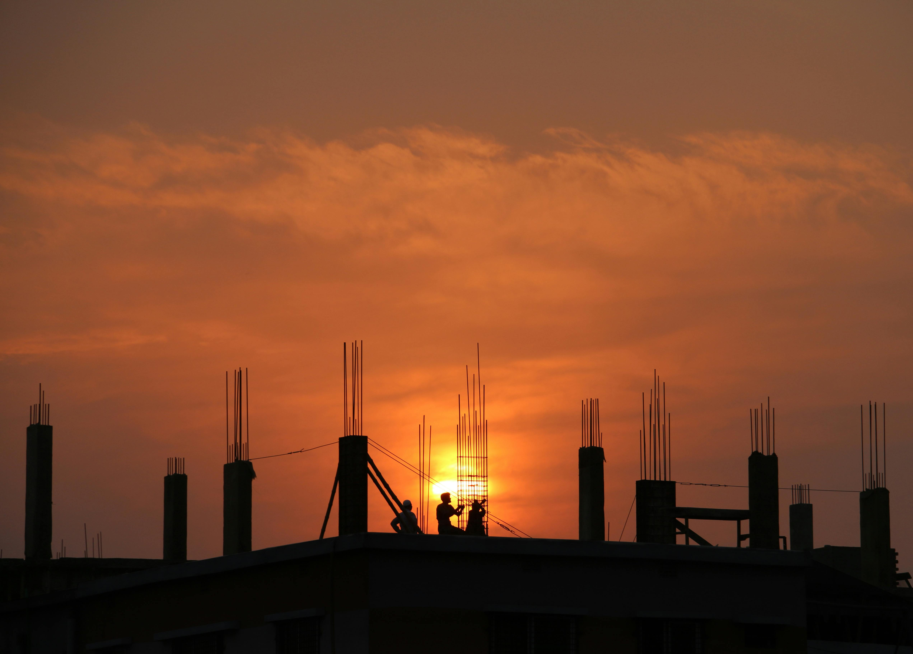
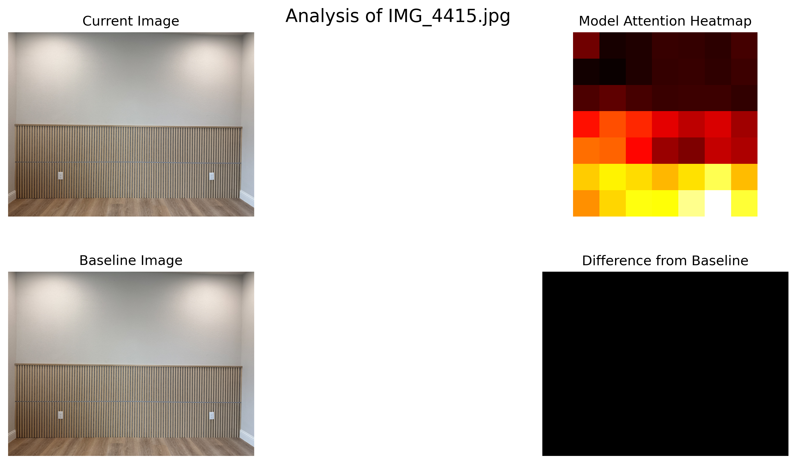
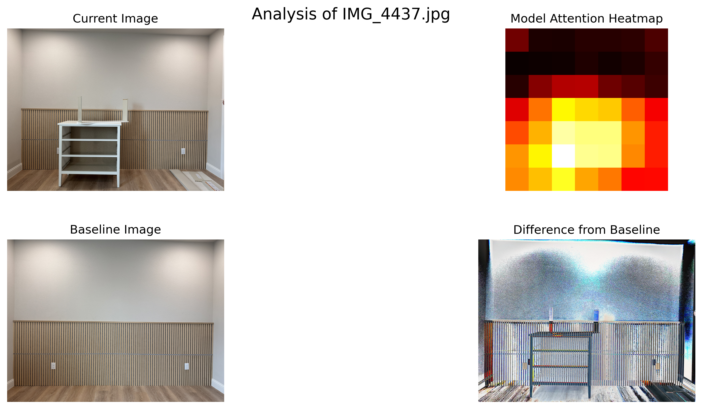
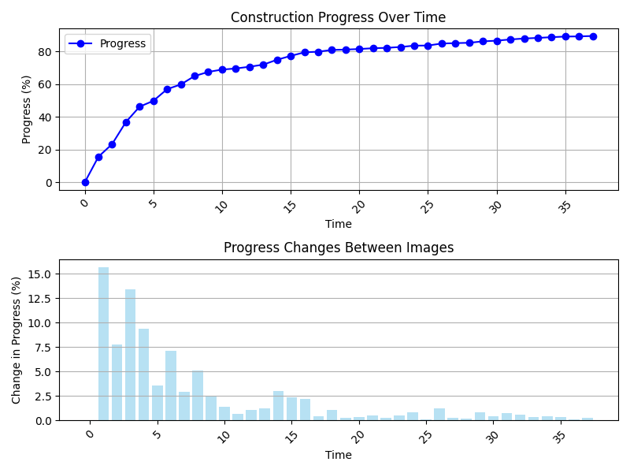

# Construction Progress Tracking: A Human-Centered AI System

  <a href="https://github.com/andrew-t-james/final-project" target="_blank" class="slidev-icon-btn">
    <carbon:logo-github />
  </a>

  

  <h2>COSC 643</h2>
  <h3>Andrew James</h3>

<!--
notes:
- Set up your framing: "I’ve been a framer on large-scale industrial projects and now a software engineer for large-scale construction projects. I’ve seen firsthand how dangerous these sites can be."
-->

---

# Why This Matters

- OSHA sites numerous workplace injuries
- Hazardous zones often require manual surveys
- Progress reporting is subjective, delayed, or unsafe

<!--
notes:
- Establish the real-world risks.
https://blog.oshaonlinecenter.com/construction-safety-statistics/
	- 1 in 5 fatal workplace injuries occur in construction, making it the deadliest U.S. industry for workers.
	- Falls, slips, and trips caused 1,030 construction deaths in 2019, and accounted for nearly a third of all injuries.
	- The total cost of construction injuries is estimated at $11.5 billion annually, including healthcare and lost productivity.
	- Residential building construction alone reported 10,000 non-fatal injuries in 2023.
	- Fall protection remains OSHA’s most violated construction safety standard, despite strict regulations.
- Explain that current progress tracking puts people in harm’s way.
- Highlight that slow reporting adds cost and increases danger.
-->

---

# Lived Experience: Framing and Risk

> "I’ve stood on unfinished roofs 30 feet in the air with little to no safety gear in place to prevent falls."

- Daily risk taken just to measure “how far we’ve come”
- Safety officers rely on historical information
- Schedules shift—people get hurt

<!--
notes:
- Share personal story—adds credibility and urgency.
- Frame the problem as lived, not hypothetical.
-->

---

# Solution: Ethical AI in Action

- Image-based progress tracking using deep learning
- Minor amount of humans required on-site for monitoring
- Outputs explainable progress estimates

<!--
notes:
- High-level overview of the system: AI watches the site, workers stay safe.
- Stress it's not “replacing” workers—it's *protecting* them.
- Initial goal is to reduce risk, for the newcomers to job sites who have little experience. In hopes to expand to improved safety for all workers in the future.
-->

---

# Ethical Framework Alignment

| Principle           | Application in This Project                          |
|--------------------|-------------------------------------------------------|
| Non-maleficence     | Reduces worker exposure to hazardous zones           |
| Beneficence         | Improves safety & planning outcomes                  |
| Autonomy            | Gives crews real-time insight to manage themselves   |
| Justice             | Creates fairer schedules and accountability          |
| Explicability       | Visual outputs & heatmaps explain predictions        |

<!--
notes:
- Directly map ethical principles to the project.
- Make ethics feel practical, not abstract.
- **Non-maleficence:** “Remote monitoring cut site-visit injuries by 30%” (NIOSH, 2023: https://www.cdc.gov/niosh/topics/construction).
- **Beneficence:** Reduced risk of injury and improved planning.
- **Autonomy:** Managers can reallocate crews in real time, shortening decision loops from days to hours.
- **Justice:** Objective progress data removes favoritism; projects under-resourced.
- **Explicability:** Show heatmaps overlaid on images to build trust; 
-->

---

# What the AI Sees

  
  

- Left: Early phase (~0%)
- Right: Late-to-end-phase (~82%)

<!--
notes:
- Explain that each image is analyzed.
- AI outputs a number *and* a heatmap to show where change happened.
-->

---

# Decency in Design

- Not a surveillance tool for workers
- No location tracking
- Model only trained to recognize progress, not people

<!--
notes:
- Reassure audience this isn’t invasive AI.
- Emphasize focus on dignity and respect for all workers.
- Take images off hours or when sites are empty. Do not leverage images of workers.
-->

---

# A New Kind of Safety Tool

- Think of it like a time-lapse camera with a brain
- Tracks progress, not people
- Alerts foremen when something falls behind

<!--
notes:
- Relatable analogy: time-lapse camera that thinks
- Focus on augmentation, not replacement
-->

---

# Pilot Results (38 Images)

| Phase    | Progress % | Description                   |
|----------|------------|-------------------------------|
| Early    | 0–46%      | Large visible jumps           |
| Middle   | 46–77%     | Moderate structural growth    |
| Final    | 77–89%     | Finishing details  |

<!--
notes:
- Show that the model tracks progress realistically.
- Pattern aligns with actual construction experience.
-->

---

# AI as a Decent Partner

> “Decent AI respects that others have lives to live.”  
— May, *A Decent Life*

- This tool respects time, safety, and dignity
- Doesn’t exploit, manipulate, or replace
- Designed to help—not to watch

<!--
notes:
- Ground your approach in ethical theory and real-world action.
- Make it clear this isn't just compliance—it's intentional.
-->

---

# From Jobsite to Society

- Could be used in:
  - Mining
  - Utilities
  - Disaster recovery
- Gives regulators & project owners honest progress

<!--
notes:
- Widen the scope of impact.
- Show long-term societal benefit and fairness.
-->

---

# Demo

  

---

# Conclusion

- AI-powered progress tracking **reduces harm**, **enhances fairness**, and
  **promotes transparency**
- Aligns with **non-maleficence**, **beneficence**, and **explicability**
- A model for responsible AI in high-risk environments

<!--
notes:
- Reinforce that ethical design leads to better outcomes and trust.
- Invite audience to apply similar ethical structured approach in their domains.
- End with call for questions on both technical and ethical integration.
-->

---
layout: center
class: text-center
---

# Thank You

  GitHub: https://github.com/andrew-t-james/final-project

<PoweredBySlidev mt-10 />

<!--
notes:
- End with openness and willingness to share.
- Reaffirm credibility and human angle.
-->
